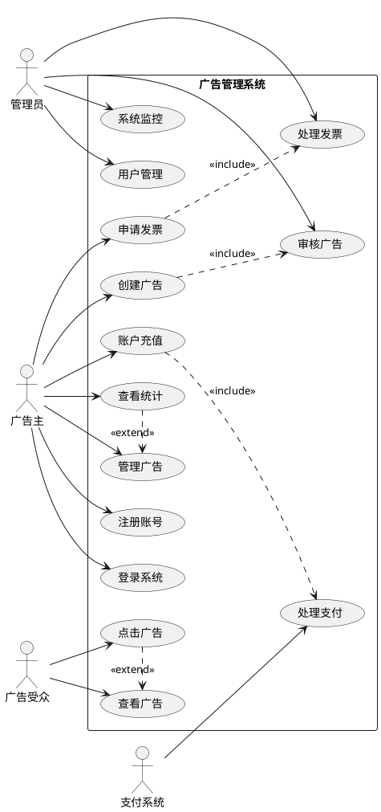
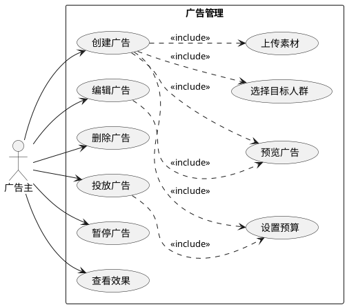
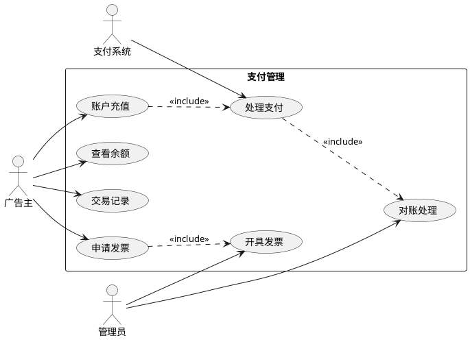
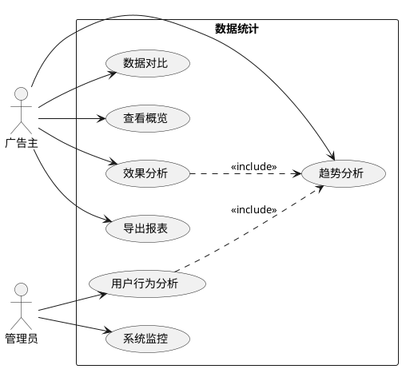

# 互联网广告平台用例分析文档 v1.0

## 1. 系统总体用例图

## 2. 广告管理子系统用例图

## 3. 支付子系统用例图

## 4. 数据统计子系统用例图

## 5. 主要用例详细说明

### 5.1 创建广告用例

**用例名称：** 创建广告

**参与者：** 广告主

**前置条件：**
1. 用户已登录系统
2. 账户余额充足

**基本流程：**
1. 用户点击"创建广告"按钮
2. 系统显示广告创建表单
3. 用户填写广告信息：
   - 广告标题
   - 广告描述
   - 选择广告类型
   - 上传广告素材
   - 设置目标URL
   - 设置投放时间
   - 设置预算
4. 用户提交广告信息
5. 系统验证信息完整性
6. 系统创建广告并提交审核

**替代流程：**
- 4a. 信息不完整：
  1. 系统显示错误提示
  2. 返回第3步
- 4b. 余额不足：
  1. 系统提示充值
  2. 跳转到充值页面

**后置条件：**
1. 广告进入待审核状态
2. 系统发送审核通知

### 5.2 广告审核用例

**用例名称：** 广告审核

**参与者：** 管理员

**前置条件：**
1. 管理员已登录系统
2. 存在待审核广告

**基本流程：**
1. 管理员查看待审核列表
2. 选择待审核广告
3. 检查广告内容：
   - 内容合规性
   - 素材规范性
   - 链接安全性
4. 做出审核决定
5. 填写审核意见
6. 提交审核结果

**替代流程：**
- 3a. 发现违规内容：
  1. 标记违规原因
  2. 直接拒绝
- 4a. 需要修改：
  1. 添加修改建议
  2. 返回广告主修改

**后置条件：**
1. 更新广告状态
2. 通知广告主审核结果

### 5.3 支付处理用例

**用例名称：** 账户充值

**参与者：** 广告主，支付系统

**前置条件：**
1. 用户已登录系统
2. 支付系统正常运行

**基本流程：**
1. 用户选择充值金额
2. 选择支付方式
3. 生成支付订单
4. 跳转支付界面
5. 完成支付
6. 验证支付结果
7. 更新账户余额

**替代流程：**
- 5a. 支付失败：
  1. 显示失败原因
  2. 允许重试支付
- 6a. 验证超时：
  1. 等待异步通知
  2. 用户可手动查询

**后置条件：**
1. 更新账户余额
2. 生成交易记录
3. 发送充值通知

## 6. 用例关系说明

### 6.1 包含关系（Include）
- 创建广告 包含 设置预算
- 账户充值 包含 处理支付
- 广告投放 包含 数据统计

### 6.2 扩展关系（Extend）
- 效果分析 扩展 广告管理
- 发票申请 扩展 支付管理
- 数据导出 扩展 数据统计

### 6.3 泛化关系
- 普通广告主 是 用户 的特例
- 超级管理员 是 管理员 的特例

## 7. 用例优先级

### 7.1 高优先级用例
1. 用户注册登录
2. 广告创建
3. 广告审核
4. 账户充值
5. 广告投放

### 7.2 中优先级用例
1. 数据统计
2. 发票管理
3. 广告管理
4. 用户管理

### 7.3 低优先级用例
1. 系统监控
2. 数据导出
3. 高级分析

## 8. 用例实现建议

### 8.1 技术实现
- 使用状态机管理广告生命周期
- 采用消息队列处理异步任务
- 实现实时数据统计
- 使用缓存优化性能

### 8.2 安全考虑
- 角色权限控制
- 数据访问控制
- 操作日志记录
- 敏感信息加密

### 8.3 性能考虑
- 分布式部署
- 数据库优化
- 缓存策略
- 异步处理
